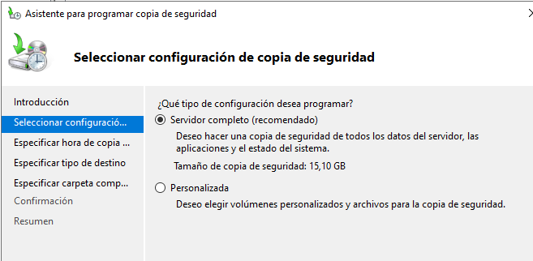
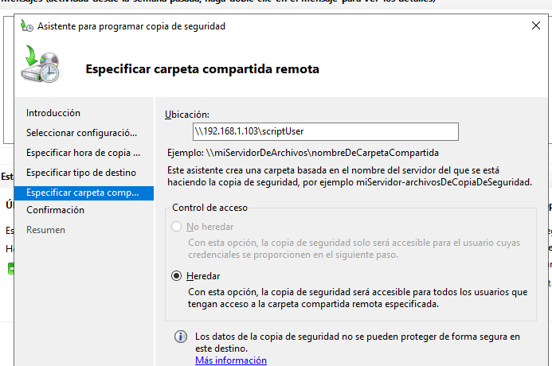

# POLÍTICA DE COPIAS DE SEGURIDAD

## INDÍCE

...

## Introducción

En este documento vamos a explicar de forma breve que tipo de estrategia de copias de seguridad vamos a implementar en nuestro sistema informático.

En nuestro caso, hemos decidido utilizar una versión de una estrategia de copias de seguridad bastante común, esta se llama 3-2-1. Además también vamos a encriptar todos los backups.

La versión que vamos a usar es la **2-1-1**

> _Cabe recalcar que esta estrategia no es perfecta, pero para el tipo de sistema que estamos implementando es más que suficiente, aunque si fuese una empresa de verdad probablemente se quedaría algo corta, también dependiendo de que tipo de empresa estemos hablando_

## Explicación más en profuncidad de _3-2-1_ y _2-1-1_

El nombre se refiere a que hay que tener 3 tipos de copias **2 de ellas** en diferentes **tipos de unidades** de almacenamiento y la **última** en algún sitio fuera, en este caso **AWS**. Esta forma sería la ideal, pero debido a como tenemos montado el sistema informático, no vamos a poder usar la regla 3-2-1, en cambio, vamos a utilizar la regla **2-1-1** alterada por nosotros mismos.

En que consiste **2-1-1**. Esta modificación indica que vamos a tener 2 tipos de copias una será la que tengamos guardada en el servidor de almacenamiento, específicamente en el directorio compartido por NFS. La otra copia estará almacenada en el servidor de backups de **AWS**.

Porque hemos decidido usar esta versión. Aunque esta versión es un poco arriesgada, nos podrá sacar de un apuro si tenemos algún problema en la sede física. Digo que es arriesgada porque se deberían de tener 2 copias en la misma sede no únicamente una.

...texto de abajo entre "```" mejor resumido...


Mejorar el siguiente texto porque no está correctamente explicado.

```

**Tres** tipos de copias:

Un backup primario, y luego 2 copias más de los datos.

Tendremos 2 tipos de backups primarios:

1. El **primero** será destinado a copias de los equipos como **servidores**, **equipos de red** y demás dispositivos importantes. 

    Las **copias regulares** de los servidores y equipos de red se harán cada semana, ya que de normal no se harán muchas configuraciones en los equipos, pero es bueno preservar actualizados los backups. **Se mantendrá la configuración inicial**, la cual no se borrará y a partir de ahí se conservarán 2 copias más con 1 semana de diferencia. 

    > Por ejemplo, esta semana se hace una copia, la semana que viene se hace otra y ya la semana siguiente se borrará la primera copia que se ha hecho y se hará una nueva. **Obviamente la copia inicial NO hay que borrarla**

2. El **segundo tipo** estará destinado a los datos como tal de la empresa. Básicamente los directorios compartidos, donde están las carpetas personales, etc.
    
    Las copias de seguridad en este tipo de datos se realizarán cada día y se harán 3 tipos de copias, la primera será **Full Backup**, la cual será también 1 vez a la semana y las 2 siguientes serán incrementales.


El backup primario destinado a servidores y equipos de red será de tipo **FULL BACKUP**. 

En el caso de los equipos de red se hará un backup cuando esté todo configurado con sus vlans y demás, y cuando se haga una configuración importante se volverá a realizar un backup.

En el caso de los servidores se clonará tal y como está el sistema.

> Todas las copias serán **encriptadas**, tanto los backups de los equipos importantes como los datos importantes de la empresa

**Dos** tipos de almacenamiento diferente:

Se refiere que hay que guardar las copias de seguridad en 2 tipos de unidades de almacenamiento distintas.

**Una** copia fuera del centro de trabajo:

Se refiere a tener un sitio físico donde almacenar las copias de seguridad y debe de estar alejado geográficamente hablando de la empresa. Básicamente almacenamiento **Cloud**, como puede ser AWS.

Aquí se subirá el Full Backup de todo.

```


# CÓMO SE CONFIGURARAN LOS EQUIPOS

## EQUIPOS WINDOWS SERVER

> **EQUIPOS A LOS QUE AFECTARÁ**
>
> - Srv-Empresarial (PDC)
> - Srv-Secundario (SDC)
> - Srv-Aplicaciones
> - Srv-Datos

En este caso, para los servidores windows vamos a utilizar una característica de windows llamada `Copias de seguridad de windows server`, esto nos permitirá crear un backup de la máquina completa, para evitar problemas.

Los backups de la máquina los guardaremos en una carpeta compartida por NFS (la del NAS), en esta carpeta compartida, crearemos un directorio para cada servidor donde se irán guardando las copias de seguridad. Necesitaremos también el **Cliente NFS** en los servidores, para ello tendremos que instalar las características de cliente NFS `características > Cliente para NFS`. Además tenemos que **montar** la carpeta compartida por NFS usando powershell, el siguiente comando será el que hay que usar para montarlo:

> **Recordar dar los permisos corresponidentes a la carpeta compartida NFS**

Existen 2 alternativas fáciles de aplicar, o con el progrma mount.exe (antiguo) o con el de powershell (New-PSDrive)

```powershell
# mount.exe && umount.exe
mount.exe 10.1.1.1:/carpeta X:\

umount.exe X:\

# Alias de "New-PSDrive" es "mount" que no igual a "mount.exe", son programas distintos.
New-PSDrive -Name "X:\" -PSProvider "FileSystem" -Root "\\10.1.1.1\carpetaCompartida" -Persist

Remove-PSDrive X

### Es posible usar DNS o IP (como siempre)
### Es preciso usar la nomenclatura UNC "\\...\..." , pero sigue siendo una carpeta NFS
```

[MÁS INFO](https://www.server-world.info/en/note?os=Windows_Server_2019&p=nfs&f=4)

    

[Alternativa en Powershell de las copias de seguridad](https://learn.microsoft.com/en-us/powershell/module/windowsserverbackup/?view=windowsserver2022-ps)




> ---
>
> Al final, **NO se puede hacer lo siguiente**, ya que el servicio de copias de seguridad no es totalmente compatible con NFS así que aunque si deje pasar esta fase, en la parte de comprobación (donde hay que elegir de que hacer la copia) dará error. Este error se soluciona compartiendo la carpeta en SMB
>
> 
>
> Hay que tener en cuenta que para indicar la ruta de la carpeta compartida por NFS también hay que utilizar la nomenclatura **UNC**, para que windows lo pueda leer correctamente.

Solución al problema de no poder hacer las copias de seguridad usando un directorio compartido NFS.

1. Usar un software de terceros que si lo permita (no en este caso)

2. Compartir una carpeta en el servidor de datos por SMB y que ahí guarden los servidores las copias y luego pasar del servidor de datos al servidor nfs

3. Guardarlo en un directorio local del servidor y luego enviarlo mediante nfs del servidor en cuestión al servidor NAS.

## EQUIPOS LINUX

En el caso de los equipos Linux, usaremos la herramienta `rsync` la cual es bastante potente.

## EQUIPOS DE INTERCONEXIÓN DE RED