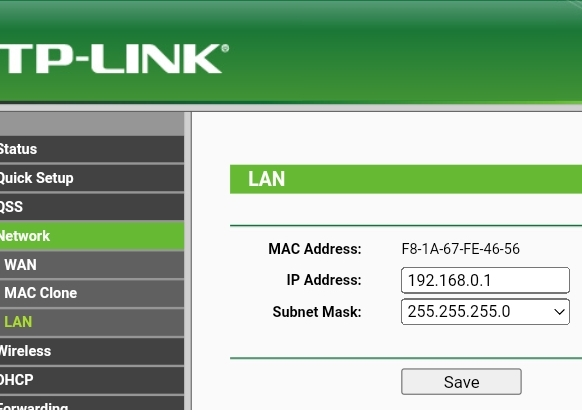
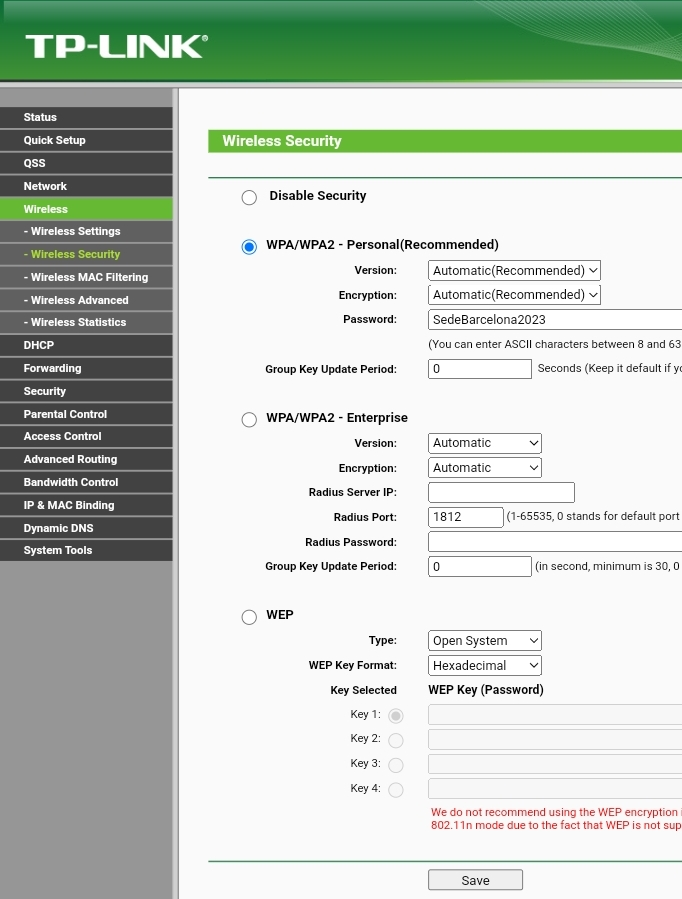
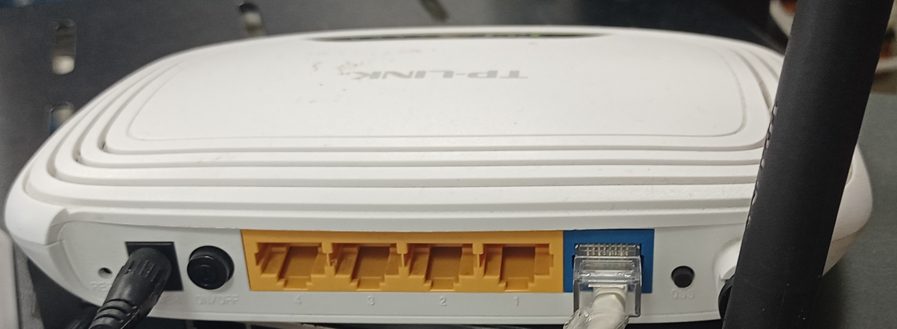

# Configuración del Punto Wifi

## Configurar el router 
 - Para configurar el router tenemos que conectarlo por red a un pc y ponemos la ip que es 192.168.0.1. Una vez dentro nos pedirá que pongamos el user y la password, en los dos casos es admin.

  - Esta es la pagina Principal de la configuración del router.

 - Una vez dentro entramos en la pagina principal tenemos que ir a la configuración del Network y una vez dentro en LAN, para poner la ip que queramos que tenga el router o por si queremos cambiarla, si no queremos hacer nada de esto no hace falta entrar.
 

 - Si entramos en Wireless y dentro en Wireless Settings podemos entrar para cambiar la configuración del nombre de nuestro punto Wifi.
 

 - Si entramos en Wireless y dentro en Wireless Security entramos para ponerle la password que queremos que tenga (# MUY IMPORTANTE QUE ESTE LA OPCIÓN DE WPA/WPA2... MARCADA)
 

 - Si entramos en DHCP podemos poner el rango de la red que tiene que repartir.
 

 - Por último damos a save para guardar la configuración y nos aseguramos que funcione correctamente.
 
 - NOTA nos aseguramos que el router esta bien conectado a la red.
 

