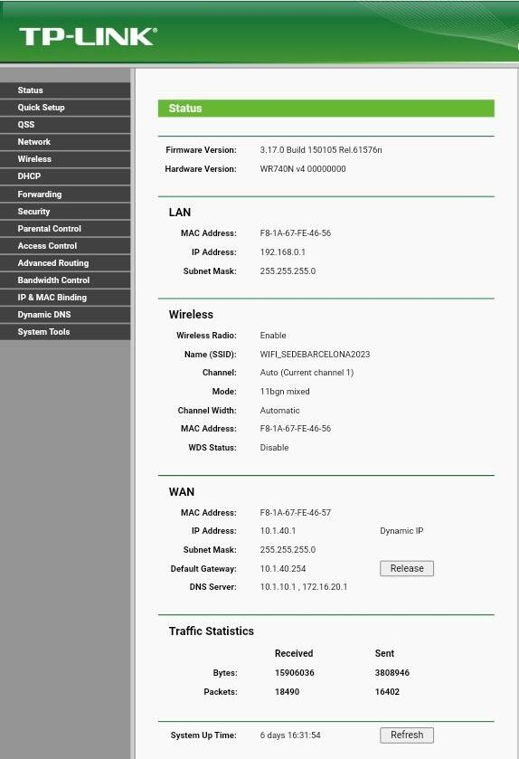

# Configuración del Punto Wifi

## Configurar el router 
 -Para configurar el router tenemos que conectarlo por red a un pc y ponemos la ip que es 192.168.0.1. Una vez dentro nos pedirá que pongamos el user y la password, en los dos casos es admin.

  - Esta es la pagina Principal de la configuración del router.

 -Una vez dentro entramos en 
