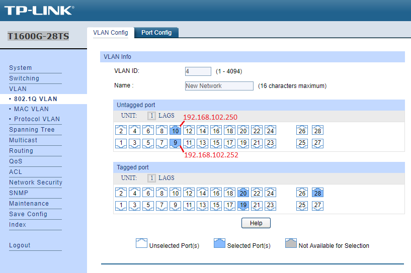
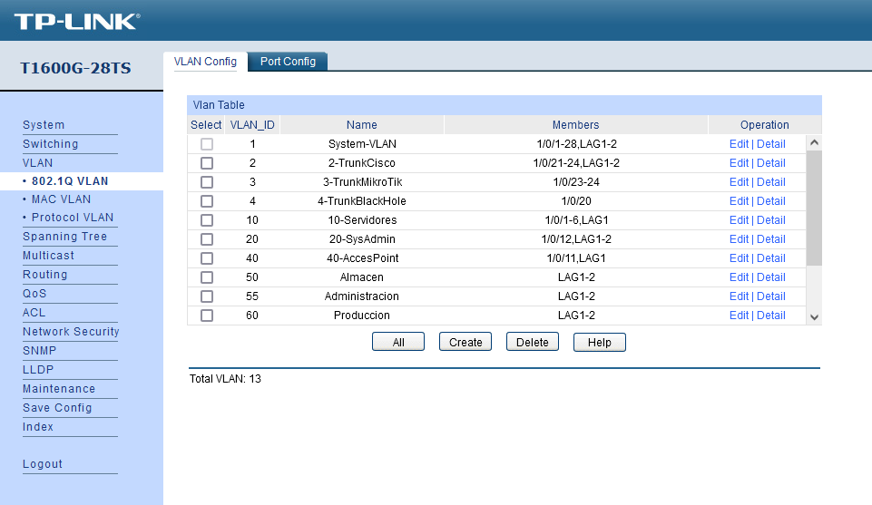
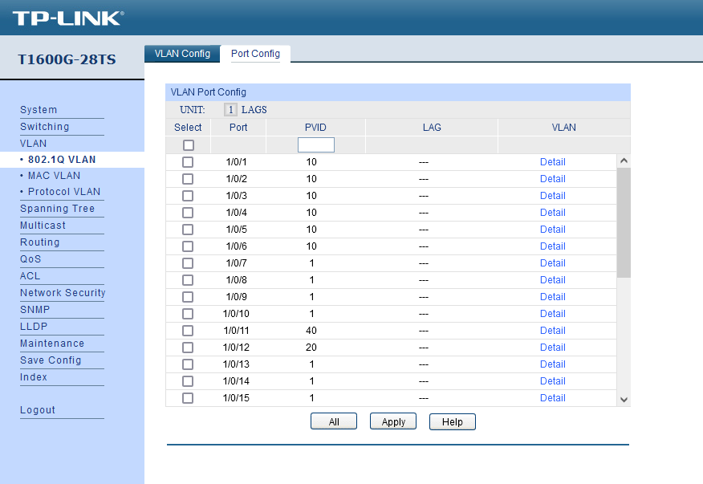
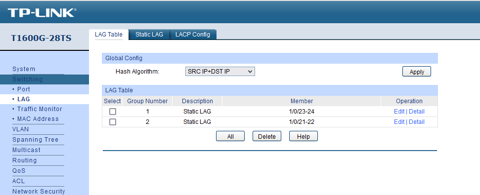
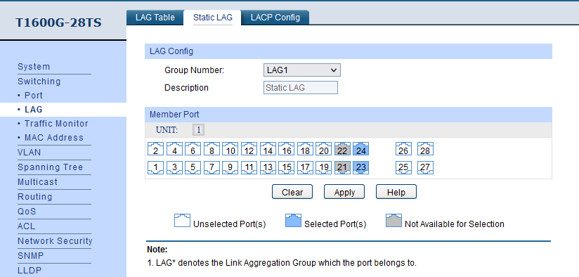

# Docuemtación de la configuración de el switch TP-LINK

En este documento, se detallarán todas las distintas configuraciones relizada en el switch TP-LINK centradose principalmente en la creación de las VLANS y el Bounding.

## Creación de VLAN

1. Para la creación de VLAN en el switch, deberemos conectarnos a la página de administración de el mismo, por defecto, suele ser la IP `192.168.0.1`. Para ello, nos conectaremos con un calbe al switch y configuraremos nuestro adaptador de red con una dirección IP del mismo rango a la del switch, pero que no sea la misma.

2. Una vez nos enconetremos en la pagina de administración del switch, nos dirigiremos al apartado `VLAN > 802.1Q VLAN`.  

    Cabe destacar que en el caso de este swtich, los puertos *tagged* son lo que conservan la eqtiqueta de la VLAN, es decir, puertos trunk y los puertos **untagged* son los puertos los cuales no matienen la etiqueta y son llamados generalmente *access*.

    A continuacioón, adjuntaré una imágen para visualizar lo que estoy tratando de explicar.

3. Volviendo al la creación de las VLAN, en la seecion `802.1Q VLAN`, nos encontraremos un menú parecido a este pero con una única VLAN con ID 1 llamada `System-VLAN`que es la VLAN a la que se asiganan todos losp uertos por defecto de el switch:

  

Para crear una VLAN, lo que deberemos hacer es pulsar el boton *Create*, despúes, no aparecera un menu igual al de la primera [IMAGEN](../Imagenes/TP-LINK/vlan.png).

Ahi dentro, deberemos escoger los puertos que dessemos añadir a la VLAN, su ID y un nombre.

Cabe destacar que, dependiendo del uso que le queremos dar al puerto, deberemos decidir si el puerto es *Tagged* o *Untagged* dependiendo de si van conectadas a un equipo, o vienen de otro switch con otras VLAN que no deben ser desetiquetadas.

4. Una vez hayamos creado la VLAN deseada (Con su ID, nombre y puertos asignados), deberemos dirigirnos a la pestaña *Port Config*, donde deberemos asignar a dichos puertos el PVID (ID) de la VLAN que hemos creado, de lo contrario no se vincularán dichos puertos a la VLAN.

Con estos sencillos pasos, ya tendríamos nuestras VLAN creadas.

## Bounding o agrupación de interfaces

Lo que se va a explicar a continuación será la creación de un *Bounding* o agrupación de interfaces, es decir, unir 2 puertos ethernet de el swtich para que actúen como uno solo, ganado así un mayor ancho de banda y velocidad a cambio de "perder" 1 conector en el proceso.

A continuación, adujunto una imagén de el apartado *LAG Table*, que nos muestra un resumen de las LAG (Agrupaciones de puerto) creadas así como de los puertos que las conforman:

1. Para ello, lo primero que haremos será dirigirnos a el apartado *Switching* > *LAG* > *Static LAG*. Ahí veremos un pequeño menu con un "mapa" de todos lo puertos disponible en el switch.

    Pues bien, para crear un LAG, que es el nombre que le da TP-LINK a una agrupación de puertos, deberemos escoger el numero de grupo que tendrá el LAG (Si no hemos creado ninguno, lo más normal es que le asigenoms el 1).

2. A continuación, seleciconaremos losp uertos que queremos que conforme la agrupación de puertos clicando sobre los símbolos de los mismos, por ejemplo, si deseamos que la agrupación de puertos se componga de los puertos 23 y 24 de el switch, seleccionarmeos los mismos y pulsaremos al botón apply.

Con ellos, ya tendríamos la agrupación de puertos creada, ahora, tan solo haría falta asignarlo a una VLAN conforme a nuestras prefencias, como por ejemplo, utlizarla como una VLAN en modod "trunk" para que permita el paso de otra VLAN desde otro switch hasta el router sin que pierdan la etiqueta, cosa que se explicará en el siguiente apartado.

## Creación de VLAN en modo *Untagged* utlizando una agrupación de puertos

El último aspecto importante a detallar, será la creación de una VLAN exclusivamente para poder permitir el paso de otras VLAN creadas en un switch (ej. un switch cisco conectado a nuestro swtich TP-LINK) hacia nuestro router, el cual esta directamente conetado a nuestro switch TP-LINK.

El problema que nos presenta esto es que las VLAN provenientes de otro switch, deseamos que atreviesen nuestro switch TP-LINK si que éstas VLAN sean desetiqeyadas en el proceso, ya que queremos que la conserven para que cuando llegue a nuestro router, este las reconozca.

1. Para ello, crearemos 2 VLAN, una para los datos de la VLAN que vienen desde el otro swtich y otra para enviar los datos al router (tanto los que provienen de otro switch conetado a al switch TP-LINK, como del propio switch TP-LINK que va hacia el router), estas dos VLAN, se compdrán cada una por una agrupación (LAG) de 2 puertos, dichas agrupaciones, deberemos haberla creado previamente siguendo el mismo método mencionado anteriormente.

