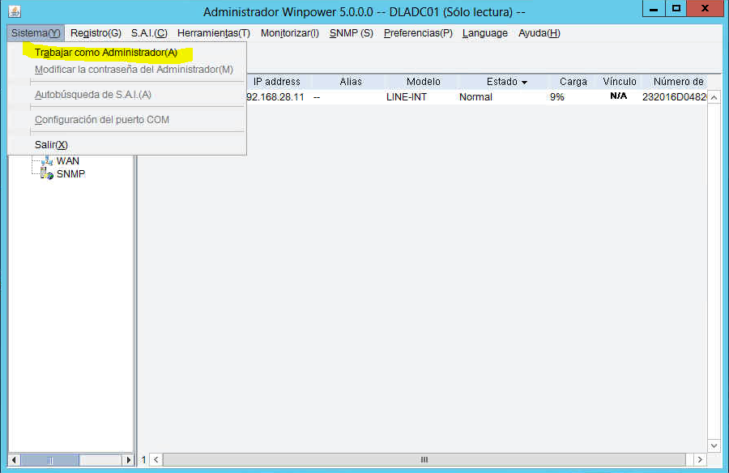

# Instalación y Configuración del SAI con WinPower

## Pasos de Instalación

1. Descarga el software WinPower desde el sitio web oficial.[WinPower](https://www.salicru.com/sps-1200-soho-iec.html)
2. Ejecuta el archivo de instalación descargado.
3. Sigue las instrucciones del asistente de instalación para completar la instalación de WinPower.

## Conexión del SAI
1. Conecta el SAI por cable USB al pc

## Configuración de WinPower
 1. Entramos a WinPower.
 2. Si todo esta bien nos saldrá esta pantalla.

 
## Uso de WinPower y el SAI
 1. Para la configuración del SAI tenemos que entrar en la parte que dice SISTEMA y le decimos trabajar como administrador.
 

 
 2. Despúes vamos al apartado que dice SAI y una vez dento vamos a Parametros de Apagado.
 3. Nos saldra esta pantalla y tenemos que poner la IP de la maquina que esta haciendo de servidor del SAI para que sea la última en apagarse.

### MUY IMPORTANTE
 ## PASSWORD PREDETERMINADA Administrator
 ## PASSWORD CAMBIADA 1234
