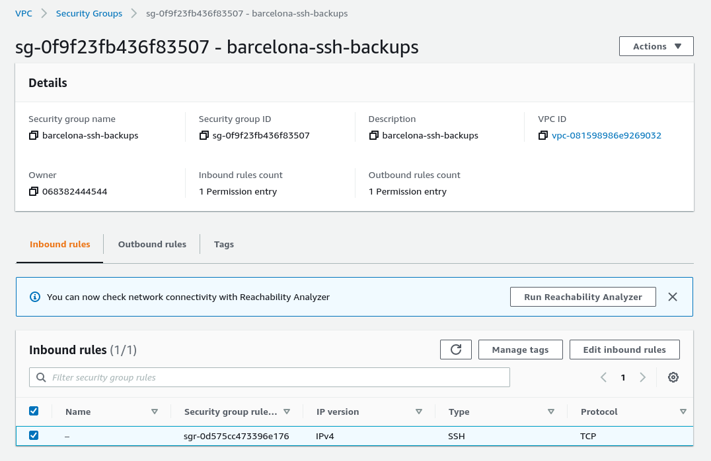
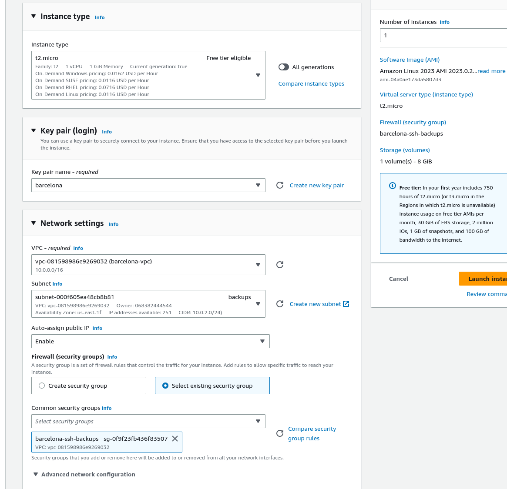
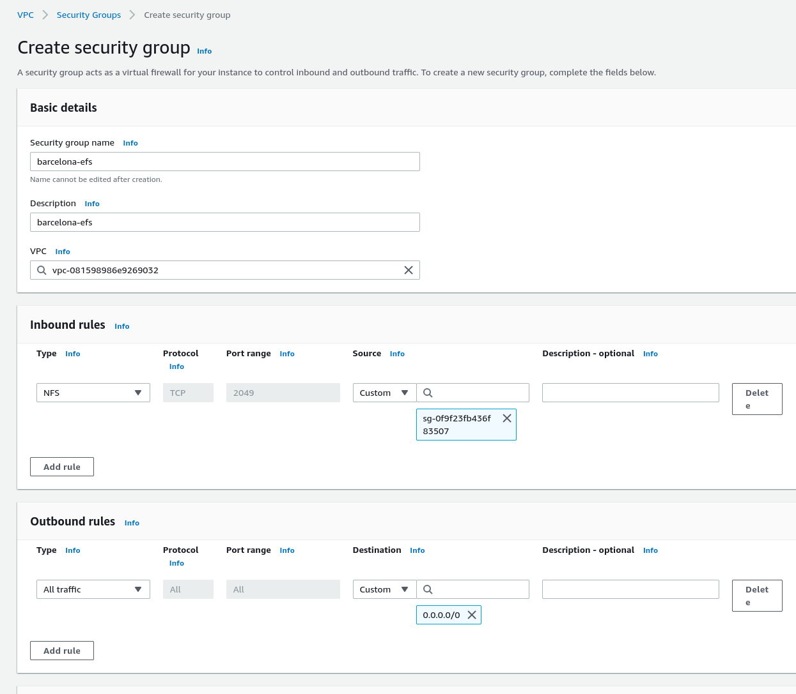
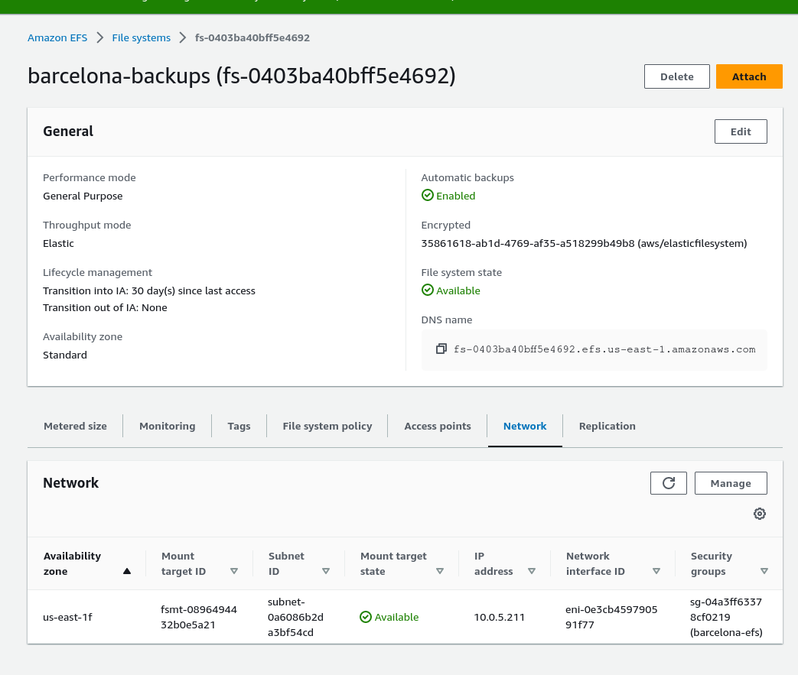
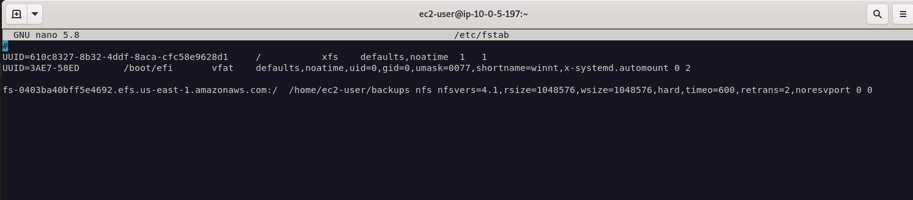
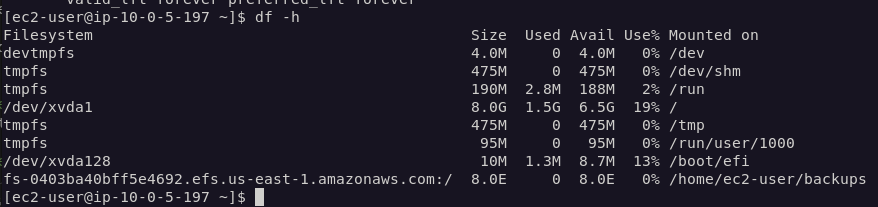

# CREACIÓN DE LA INSTANCIA DEL BACKUP

> ---
>
>**Antes necesitaremos otro security group, porque el de la intranet también tiene el puerto 80 habilitado y eso no lo queremos.**
>
>

## CREACIÓN

## CREACIÓN DEL EFS

### Primero crear el grupo de seguridad en el VPC

_Recordar indicar la ID del grupo de seguridad asignado a la instancia del backup_

## CONEXIÓN AL EFS

`yum install -y amazon-efs-utils`

editar fstab.

