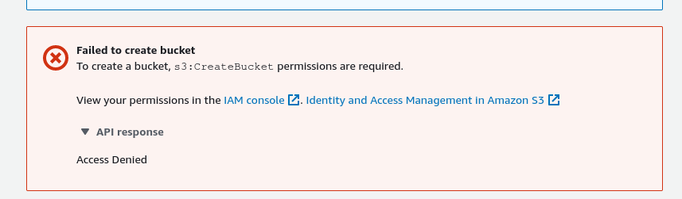
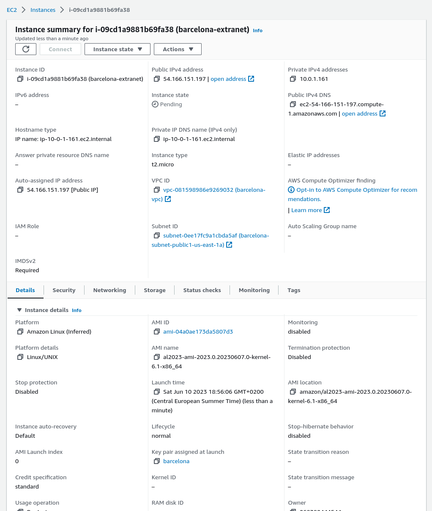
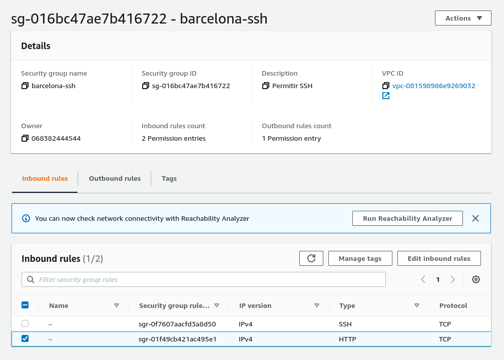
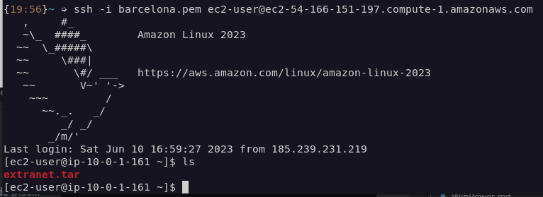
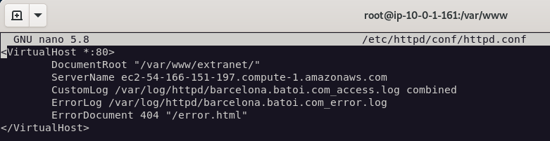

# CREAR UN BUCKET

Los buckets se utilizan para el alojamiento WEB en AWS, para crear uno vamos a `S3 > Buckets` (en la página de AWS)



>En mi caso como la cuenta que tengo es de estudiante, no permiten crear buckets, así que tendré que crear una máquina a propósito para alojar la página web.

# CREACIÓN DE LA INSTANCIA



# APACHE EN LA INSTANCIA AWS (RHEL)

En mi caso el sistema operativo es el propietario de AWS.

- 0. Iniciar ssh

`ssh -i barcelona.pem ec2-user@ec2-54-166-151-197.compute-1.amazonaws.com`

- 1. Instalar apache

`yum install httpd`

- 2. Firewall

Necesitamos usar una regla para permitir el tráfico HTTP, como estamos en AWS, eso se puede hacer desde la propia interfaz web. Habilitando el puerto 80



>- 2.1. Habilitar regla en el firewall (en el caso de que se use firewalld y de problemas por tener un sistema operativo RHEL)
>
>`firewall-cmd --permanent --add-port=80/tcp`
>
>`firewall-cmd --reload`

- 3. Activarlo para que se inicie automáticamente y que se inicie ahora mismo también

`systemctl enable --now httpd`

- 4. Añadir la extranet

A estas alturas, ya tenemos funcionando el servicio HTTPD en la instancia de AWS, falta subir la extranet, para ello primero tenemos que subir a la máquina el directorio con la extranet.

- 4.1. Subir el directorio

```bash
# Crear un tar de la extranet (se podría comprimir, pero yo no lo haré)
tar -cvf extranet.tar 1CFS/LMSGI/proyectoFinal/proyecto-integrador/altres/extranet 

# Enviar el fichero a la máquina intranet
scp -i barcelona.pem extranet.tar ec2-user@ec2-54-166-151-197.compute-1.amazonaws.com:/home/ec2-user/
```
> ---
> Luego SSH a la instancia y comprobar que se haya pasado
> 


`mv extranet /var/www/`

- 5. Creación del **VIRTUALHOST**

    - 5.1. Configuración del fichero `/etc/httpd/conf/httpd.conf`

    

    > Hay que tener en cuenta el el html del error, se basa en el DocumentRoot que hemos indicado anteriormente, así que será `/elfichero.html` o si está en alguna carpeta `/carpeta/elfichero`

[REFERENCIAS](https://access.redhat.com/documentation/en-us/red_hat_enterprise_linux/8/html/deploying_different_types_of_servers/setting-apache-http-server_deploying-different-types-of-servers#managing-the-httpd-service_setting-apache-http-server)