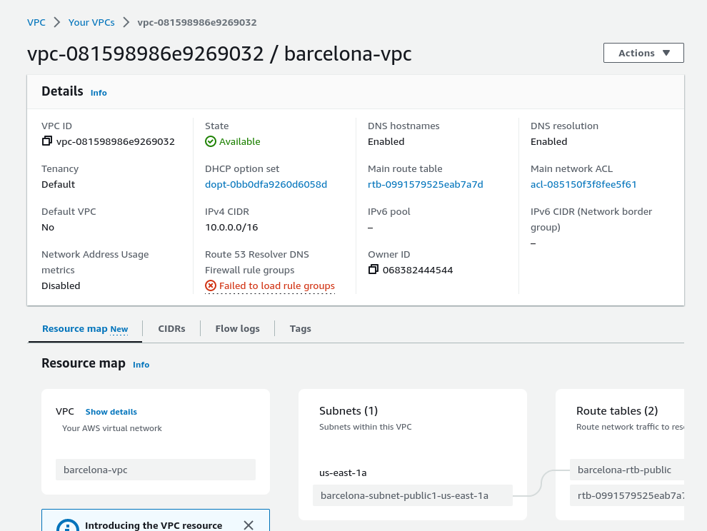

# CREACIÓN DEL VPC AWS

La siguiente captura tendrá una modificación en las subredes, para añadir otra más para el servidor de backups.

# ASOCIAR LA SUBNET NUEVA

Este paso es preciso para poder conectarnos a ella

Todas las instancias usarán el mismo .pem (gran error, pero debido al tipo de trabajo es más que suficiente), está en un zip con pwd B..@..4