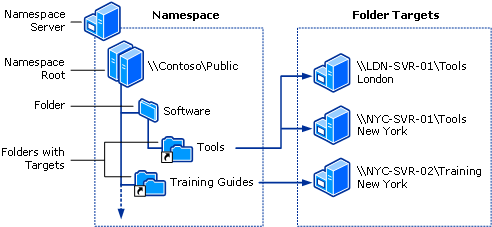
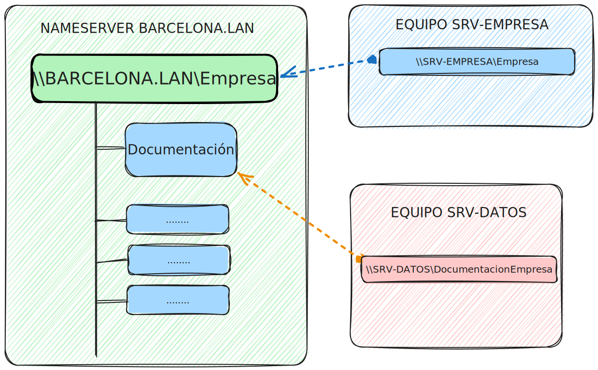

# DFS

Este programa propietario de microsoft tiene diferentes funciones, dos de las más importantes son la de los **Namespaces** _(Espacio de nombres)_ y **Replication**.

- [DFS](#dfs)
  - [NAMESPACES](#namespaces)
  - [REPLICATION](#replication)

## NAMESPACES

Los **Namespaces** son donde se crea un directorio raíz o **root** en el cual se van añadiendo diferentes directorios y algunos directorios pueden ser como como "Enlaces" a otros directorios compartidos en otros servidores, los directorios enlazados se llaman **Folder Targets** y el directorio raíz, donde acceden todos los equipos se llama **Namespace**.

La ruta principal para acceder al directorio raiz normalmente es o **un dominio** o el nombre de un servidor en la red.

Esta imagen representa como funciona de una forma fácil de entender el DFS:



**Conceptos más en profundidad**:
- **Namespaces**: Es el servidor a donde se dirigirán todas las peticiones y donde crearemos el directorio root el cual será común para todos los que se dirijan a este espacio de nombres.
- **Directorio Root**: Es un directorio que se crea en el servidor de nombres (normalmente donde está el active directory)
- **Folder Target**: Este es el directorio que estará apuntando al directorio puesto en el directorio root.

Siguiendo el esquema de abajo vemos que `\\Barcelona.lan\Empresa` es la ruta root de donde colgarán los directorios enlazados y también directorios normales. Este root está alojado en el servidor principal (SRV-EMPRESA).

Tenemos un directorio colgando del directorio root, el cual está enlazado a una carpeta compartida en el servidor `SRV-DATOS`



**COMANDOS POWERSHELL**:

```powershell
# Instalar los roles de Namespace y Replication
Install-WindowsFeature "FS-DFS-Namespace" ,"RSAT-DFS-Mgmt-Con"

# Importar el módulo DFSN (Dfs Namespace)
Import-Module DFSN

# En powershell (`) significa un salto de linea para seguir el comando y no tener todo el comando en una única linea

# Creación de un directorio Root
New-DfsnRoot -TargetPath '\\SRV-EMPRESA\Empresa' `
             -Type 'DomainV2' `
             -Path '\\Barcelona.lan\Empresa'

<#
Explicación: 
    -TargetPath: Indicamos el directorio base compartido por un servidor físico, de donde se basará el servidor root
    -Type: Indicamos el tipo de DFS que queremos, normalmente se deja el que está.
    -Path: Indicamos el directorio root, en este tenemos que indicar el dominio y el directorio root (no tiene por que ser igual que el de TargetPath)
#>

# Creación de un directorio objetivo (Folder Target) en el Namespace
New-DfsnFolder -TargetPath '\\SRV-DATOS\documentacionEmpresa' `
               -Path '\\Barcelona.lan\Empresa\Documentacion' `
               -Description 'Documentación de la empresa'

<#
Explicación:
    -TargetPath: Indicamos donde se encuentra el directorio que queremos añadir a nuestro Namespace
    -Path: Indicamos en que parte de la ruta root del namespace donede estará, en este caso dentro 
            del directorio root que hemos creado, con el nombre de directorio Empresa, así que nosotros 
            lo veremos como ..ruta...\Documentacion pero en realidad se llama ..ruta...\DocumentacionEmpresa
    -Description: Breve descripción de lo que hace.
#>
```

Existe la posibilidad de indicar dos target folders de diferentes servidores distintos en un mismo directorio en root, esto sirve por si tienes 2 (o los que sean) servidores en diferentes lugares físicos, por ejemplo en barcelona y en madrid y los dos tienen la misma carpeta compartida (por ejemplo para perfiles móviles) y que esté direccionadoa al directorio root llamada móviles. Así cuando un empleado esté en barcelona tendrá la misma ruta pero los perfiles móviles serán de barcelona y si está en madrid tendrá la misa ruta, por ejemplo `\\Empresa.lan\moviles` pero el contenido será diferente porque el servidor que comparte el directorio es diferente.

Se puede entender mucho mejor en la imagen que he puesto arriba del todo.

En el tema de permisos se puede utilizar el comadno `Grant-DfsnAccess`, pero en mi opinión creo que es mejor hacerlo desde interfaz gráfica, yendo a `propiedades > permisos avanzados` estando en el directorio Namespace compartido (básicamente poniendo en mi caso en el explorador de archivos o en el `win + r`: `\\Barcelona.lan\Empresa`)

Los permisos compartidos por el servidor target (objetivo) **se usan los mismos** en el directorio target, así que hay que tener cuidado con eso.

Hay muchas más opciones, como dejar un TTL (time to live), Failback, etc. Pero las funciones principales son más que suficientes, en el caso de una empresa hay que mirarlo con más detenimiento para tener un buen sistema DFS instalado.

>**IMPORTANTE**:
>
> Diferencias entre New-DfsnFolder y New-DfsnFolderTarget
>
>**New-DfsnFolder**: Significa que creas en el DFS Nameserver un directorio direccionandose a una carpeta compartida.
>
>**New-DfsnFolderTarget**: Significa que en una carpeta ya creada añades otro directorio objetivo y así tendrás 2 o más servidores apuntando al mismo directorio, para los temas de ubicación física y demás (explicado más abajo).


[Más info](https://learn.microsoft.com/en-us/powershell/module/dfsn/new-dfsnfolder?view=windowsserver2022-ps)

## REPLICATION

Lo ideal sería hacer réplica de la carpeta root con el servidor secundario, así en el caso de que el principal se caiga las carpetas seguirán funcionando (si se cae el de datos no)