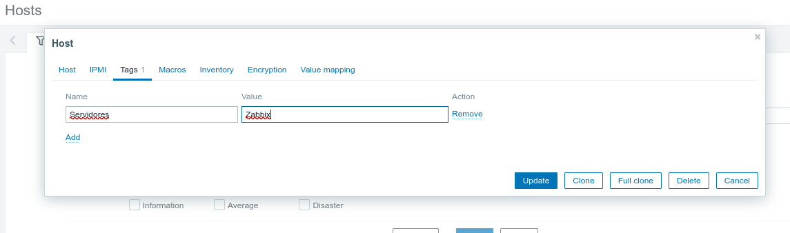

# APARTADO GRÁFICO DE ZABBIX

# 2. INDEX

- [APARTADO GRÁFICO DE ZABBIX](#apartado-gráfico-de-zabbix)
- [2. INDEX](#2-index)
- [3. DASHBOARD](#3-dashboard)
- [4. CREACIÓN DE HOSTS](#4-creación-de-hosts)
- [5. INFORMACIÓN](#5-información)

# 3. DASHBOARD

En este apartado es **IMPORTANTÍSIMO** tener los datos más relevantes, para en caso de problema poder actuar de inmediato.

En mi caso tengo el por defecto, pero debe de cambiarse.

# 4. CREACIÓN DE HOSTS

Para crear un host, son importantes las siguientes cosas:
- Indicar una plantilla (obligatorio para poder tener datos)
- Añadirlo a un grupo
- Añadir una interfaz, esta puede ser por varios protocolos, los más importantes `SNMP` y `AGENT`

# 5. INFORMACIÓN

Aquí podemos filtrar por la información que nos interesa de todos los hosts.

