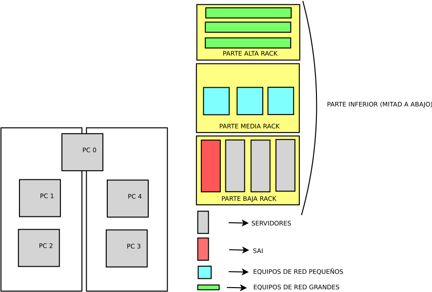
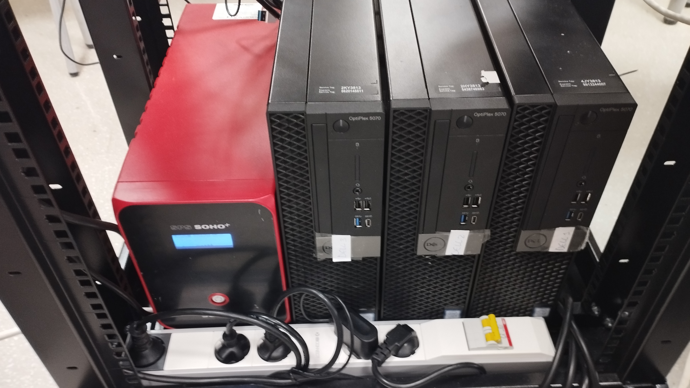
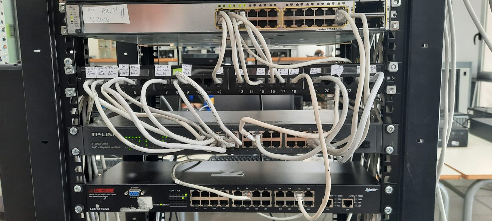
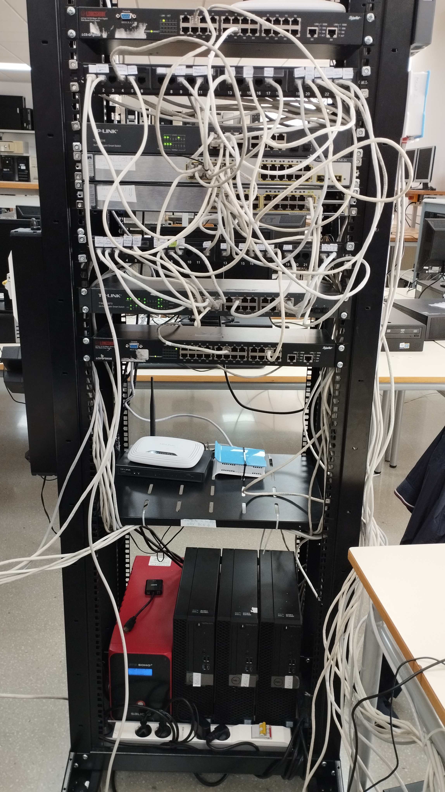
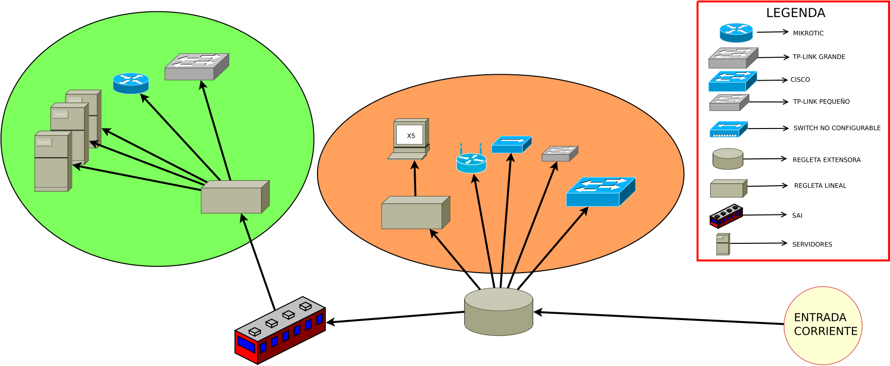

# IMPLEMENTACIÓN BÁSICA DEL SISTEMA

## INDICE

- [INTRO](#introducción)
- [MATERIAL DISPONIBLE](#material-disponible)
- [MODULO DE FH](#modulo-de-fundamentos-de-hardware)
  - [CPD](#cpd)
  - [SAI](#sai)

## INTRODUCCIÓN

En esta actividad haremos una introducción sobre el material del que disponemos y sus requisitos, además de tareas a realizar para poder empezar la implementación al taller.

## MATERIAL DISPONIBLE

Aquí estará indicado el espacio fisico y hardware disponible para el desarrollo del projecto.

### ELEMENTOS FÍSICOS

- 2 mesas ~2x1 metros
- Parte inferior de un rack

### HARDWARE

- 3 SERVIDORES
- 5 CLIENTES
- 6 DISPOSITIVOS DE RED
- 1 SAI
- 3 REGLETAS

[MAS INFO](inventari.md)

## MODULO DE FUNDAMENTOS DE HARDWARE

En este apartado de deifinirán las configuraciones a realizar sobre el modulo de fundamentos de hardware.

## CPD

### ESQUEMA DE LA ORGANIZACIÓN Y MONTAJE

### ORGANIZACIÓN DEL RACK REAL

**Servers**

**Dispositivos de red**

**Rack completo**

### ESQUEMA DE ELECTRICIDAD

## SAI

_Todos los esquemas necesarios del SAI están arriba_

Hemos elegido que el SAI alimente únicamente a los 3 servidores además del switch TP-LINK y Mikrotik, para en el caso de que se vaya la electricidad seguir teniendo internet y que los servidores no se caigan al instante. También poder avisar a los servidores virtuales por red con el switch TP-LINK.

**SERVIDORES ORDENADOS POR IMPORTANCIA**

> _De más importante a menos_

1. DELL 3
  - Porque tiene todo el almacenamiento de la sede, así que su importancia es vital
2. DELL 1
  - Porque lleva el servidor ADDC principal y el de monitorizacion
3. DELL 2
  - Sus servicios no son tan prescindibles.
