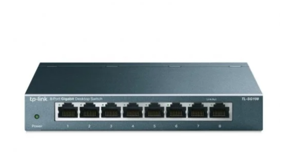

# Funció de cadascun dels elements: Servidors, dispositius d’interconnexió de xarxa

## TP-LINK

Este dispositiu el tenim com a switch "tonto" ja que sols el gastem per a conectar dos dispositius, el vam resetejar al principi per a que puguera fer aquesta funció.

## CISCO

Este dispositiu el tenim com a switch amb VLAN per a poder conduir i conectar tota la red de la nostra empresa, aquest es el switch mes important que tenim, ja que es el que o te tot conectat.

### TP-LINK ROUTER

Este dispositiu el tenim com a switch "tonto" ja que sols el gastem per a conectar dos dispositius, el vam resetejar al principi per a que puguera fer aquesta funció.
