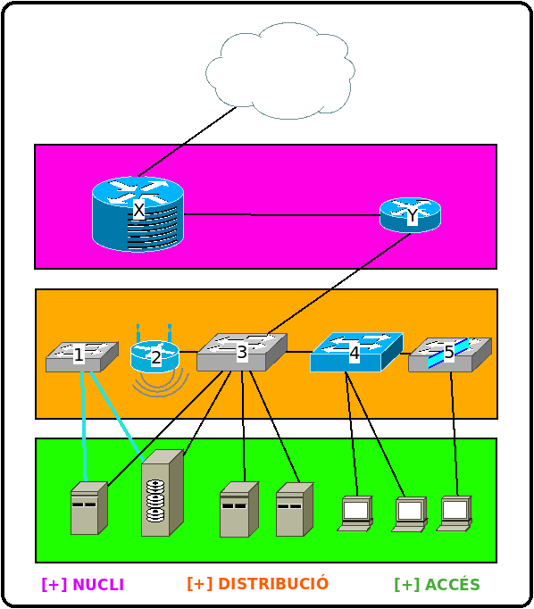
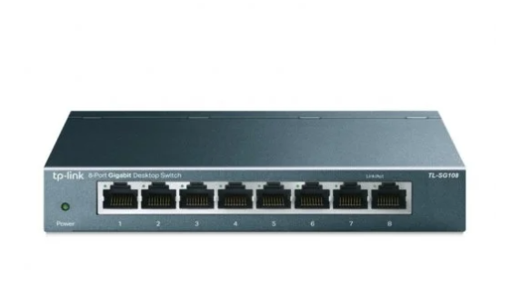
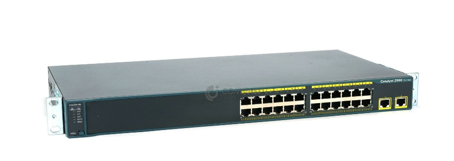
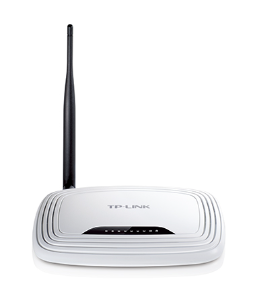
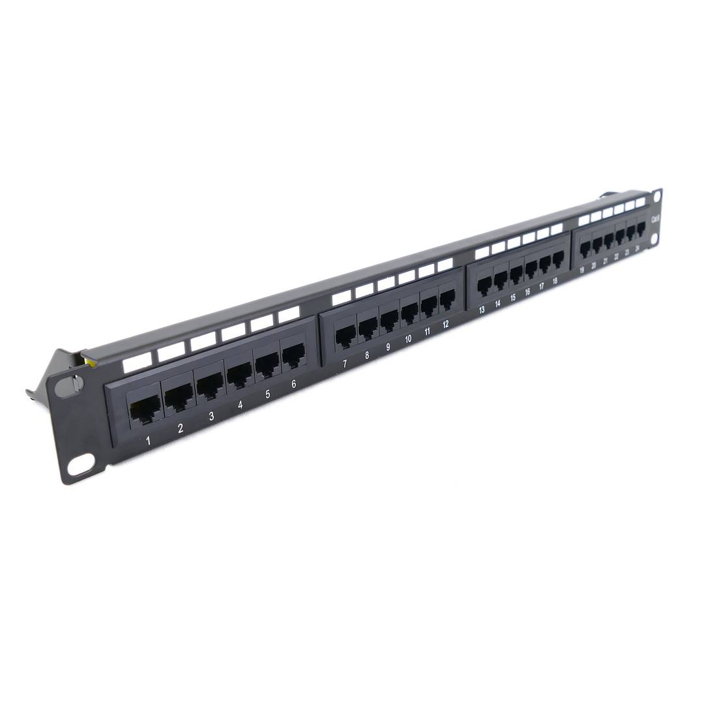
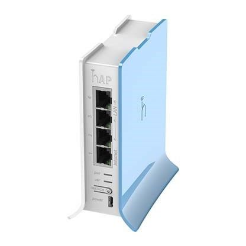
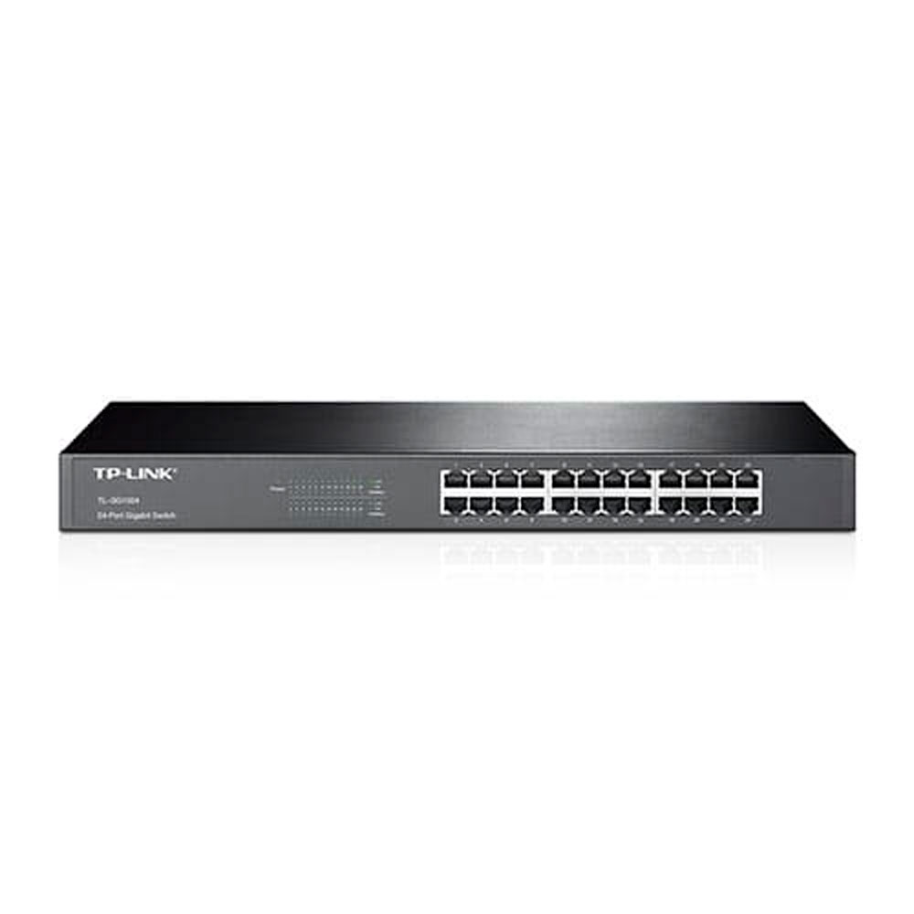
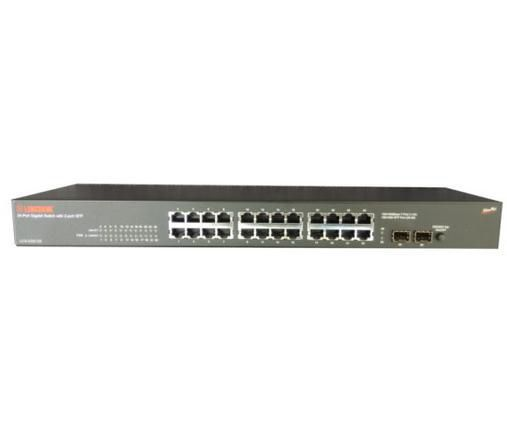

# DISSENY BÁSIC DEL SISTEMA

## INDEX

1. Esquema de la interconnexió de la xarxa
    1.1. [Estructura Jeràrquica](#estructura-jeràrquica)
    1.2. [Cablejat Estructurat]()
    1.3. [Funció del diferents elements]()
    1.4. [Eines per a l'implementació de xarxa]()
2. Dispositius d'interconnexió de la xarxa
    2.1. [Eleccio dels equips de xarxa]()
    2.2. [Esquema de connexió amb la infraestructura de xarxa]()
    2.3. [Característiques dels dispositius d'interconnexió de xarxa]()
        2.3.1.  [Consom eléctric]()
        2.3.2.  [Factors de forma]()
        2.3.3.  [Auto-MDIX]()
        2.3.4.  [Simplex, Half duplex, Full duplex]()
        2.3.5.  [Velocitat de transmissió]()
        2.3.6.  [Mecanismes de processament de trames en switchos]()
        2.3.7.  [Interfícies]()
        2.3.8.  [Port Mirroring]()
        2.3.9.  [Links amb bonding d'interfaces]()
        2.3.10. [Característiques capa 3]()
        2.3.11. ...........
        2.3.xx. [Punts d'accés]()

---

# Estructura Jeràrquica

> --- 
>
> ## Explicació de cada component
>
> **X**: Router inter-sedes [**_WAN Sedes_**]
>
> **Y**: Router Mikrotik [**_LAN Empresa_**]
>
> ---
>
> **1**: Switch TP-LINK de 8 Boques [**_SAN_**]
>
> **2**: Punt de Accés Wifi [**_LAN Empresa_**]
>
> **3**: Switch TP-LINK principal [**_LAN Empresa_**]
>
> **4**: Switch CISCO [**_LAN Empresa_**]
>
> **4**: Switch No-Configurable [**_LAN Empresa_**]
>
> _Els equips de la capa d'accés son servidors y equips clients_
>
> ---

---

# Cablejat Estructurat

---

# Funció dels Elements

## DISPOSITIUS D'INTERCONNEXIÓ DE XARXA

### 1.TP-LINK 8 PORTS

- Este dispositiu el tenim com a switch "tonto" ja que sols el gastem per a conectar dos dispositius, el vam resetejar al principi per a que puguera fer aquesta funció, el any que ve en avançar un poc mes en le treball el tendrem que posar per a que puga fer mes coses, pero aquest any ens va be en la funció que li estem donant.

### 2.CISCO

- Este dispositiu el tenim com a switch amb VLAN per a poder conduir i conectar tota la red de la nostra empresa, aquest es el switch mes important que tenim, ja que es el que o te tot conectat.

### 3.TP-LINK PUNT D'ACCÉS

- Este dispositiu el tenim com a punt wifi, este dispositiu en un punt que te la empresa per a conectarse mitjançant wifi.

### 4.PATCH PANEL

- Este es un dels dispositius mes importants que tenim, ja que es el que sencarrega de dur la conexió a tots els pc de la empresa, es on tota la xarxa esta conectada, una vegada aplega del cisco al patch panel esta conectat y va als pc de la empresa per a que puguen tenir accés a la xarxa.

### 5.MIKROTIK

- Este es el dispositiu mes important que tenim en cuant a lo que es la xarxa de la empresa, este dispositiu es dedica a enrutar la xarxa de la nostra empresa en el exterior, si aquest dispositiu no funcionara l'empresa no tendŕia xarxa.

### 6.TP-LIK 24 PORTS
- Aquest dispositiu el tenim configurat com el cisco, per aixó es dels mes importants que tenim, te VLAN,Bounding... Aquest equip es un dels que no ens pot fallar ja que la red depen de aquest dispositiu .

### 7.SWITCH LONGSHINE
- Este dispositiu el tenim com a switch "tonto" ja que sols el gastem per a conectar dos dispositius, el vam resetejar al principi per a que puguera fer aquesta funció, al any que ve igual també se li dona altra funció ja que aquest any sols el gastem per a enllaçar la red y les dispositius de la empresa.

## SERVIDORS

### SRV 1
-Aquest servidor te virtualitzades 3 máquines.

#ADDC PRINCIPAL
 - Aquest servidor te el domini principal de la empresa, per tant es el mes important de tots els que tenim.
        - INTERFAÇ DE RED: PRINCIPAL
       	- DIRECCIÓ MAC: e4:54:e8:83:02:6b
        - IP: 10.1.10.1/24
    
#MONITORITZACIÓ
- Aquest servidor te la monitorització de tots els servidors,swhitch,cisco... De tota l'empresa, ens val per a controlar que tot estiga be.
        - INTERFAÇ DE RED: MONITORIZACIÓN
       	- DIRECCIÓ MAC: 00:11:6b:68:61:cd
         - IP: 10.1.10.3/24
         
#INTRANET
- Aquest servidor te la intranet de l'empresa, on cada un dels treballadors accedeix tots els dies per fer feina o per a cualquier consulta.
        - INTERFAÇ DE RED: INTRANET
       	- DIRECCIÓ MAC: 00:11:6b:68:61:88
        - IP: 172.16.0.1/24
         
### SRV 2
-Aquest servidor te virtualitzades 2 máquines.

#ADDC SECUNDARI
- Aquest servidor te el domini per si el principal cau poder tenir una segona opció que puga suplir al primer, per tant es un dels mes importants.
        - INTERFAÇ DE RED: APLICACIONES
       	- DIRECCIÓ MAC: e4:54:e8:83:06:ea
        - IP: 10.1.10.2/24
    
#APLICACIONS
- Aquest servidor te totes les aplicacions que els treballadors tenen instal·lades per defecte amb directives en els pc, també te les aplicacions que se les dona a les treballadors per si volen instal·lar-les..
        - INTERFAÇ DE RED: MONITORIZACIÓN
       	- DIRECCIÓ MAC: 00:11:6b:68:61:cd
        - IP: 10.1.10.4/24
### SRV 3
-Aquest servidor te virtualitzades 2 máquines.

#DADES
- Aquest servidor te les dades de l'empresa per tal de tenir copies i que no es perguen.
    - Aquest s'encarrega de fer 
    - INTERFAÇ DE RED: DATOS-EMPRESA
   	- DIRECCIÓ MAC: e4:54:e8:83:01:93
    - IP: 10.1.10.6/24
    
#TRUENAS
- Aquest servidor te instal·lat el TrueNas, per tal de administrar les cuotes i la informació de l'empresa y poder fer RAID per tal de no pedre cap informació de l'empresa.
    - INTERFAÇ DE RED: CABINA-EMPRESA
   	- DIRECCIÓ MAC: 7c:c2:c6:14:10:8d
    - IP: 10.1.10.7/24
