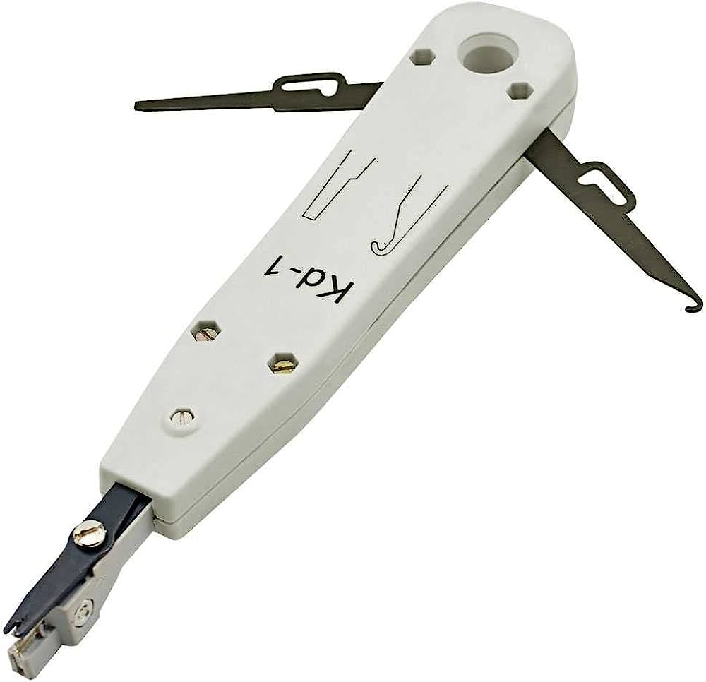
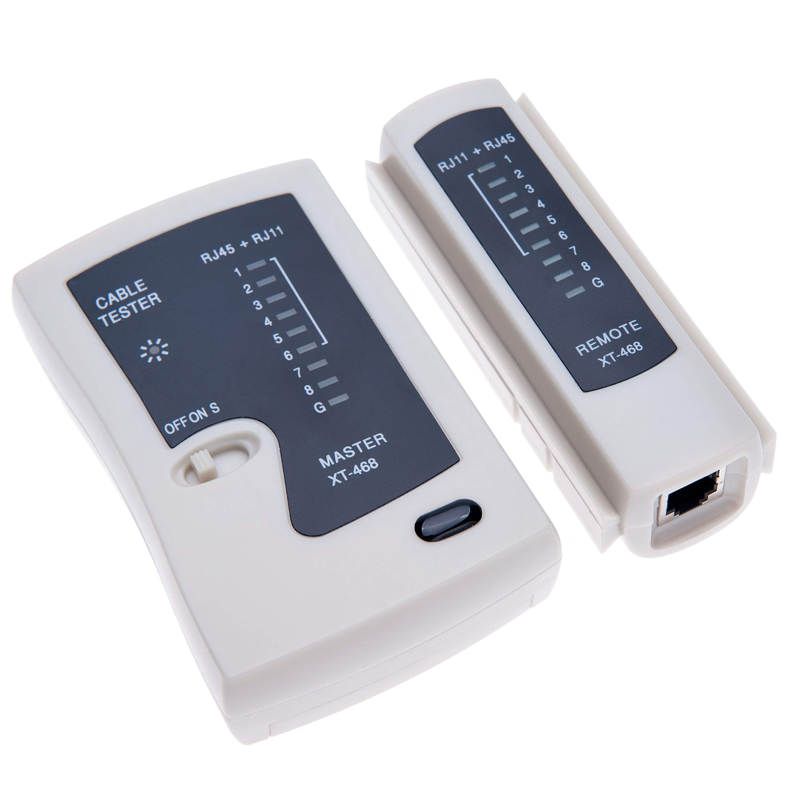
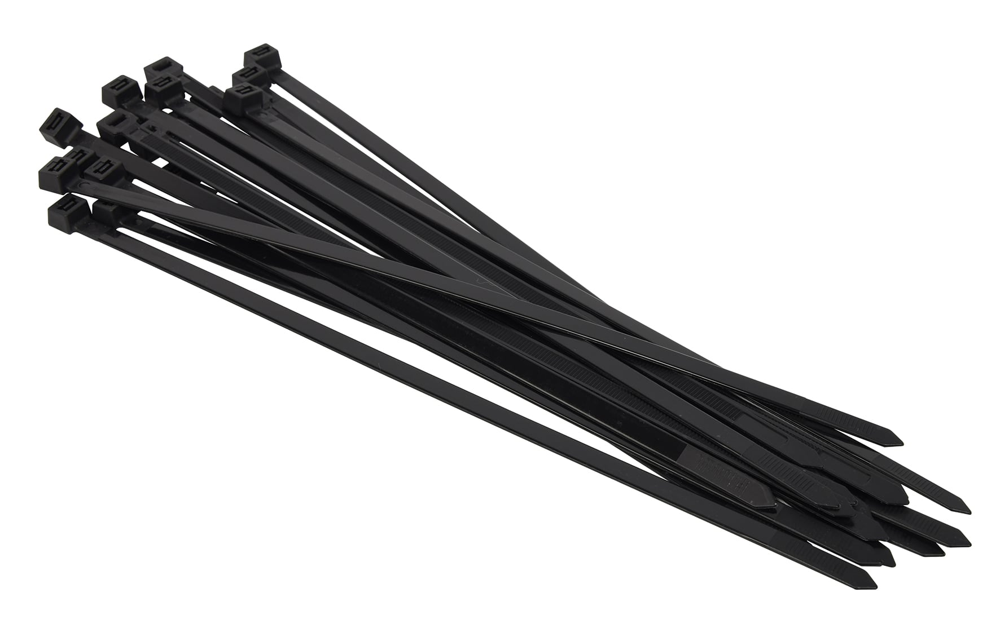
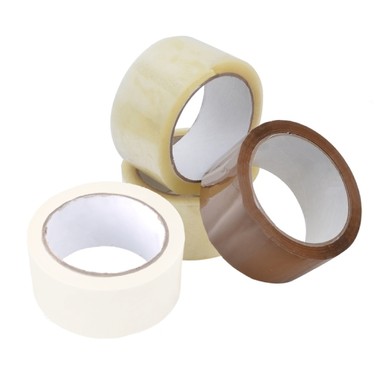

# DISSENY BÁSIC DEL SISTEMA

## INDEX

- 1. **Esquema de la interconnexió de la xarxa**
    - 1.1. [Estructura Jeràrquica](#estructura-jeràrquica)
    - 1.2. [Cablejat Estructurat](#cablejat-estructurat)
    - 1.3. [Funció del diferents elements](#funció-dels-elements)
    - 1.4. [Eines per a l'implementació de xarxa](#eines-per-a-limplementació-de-xarxa)
- 2. **Dispositius d'interconnexió de la xarxa**
    - 2.1. [Eleccio dels equips de xarxa](#ele)
    - 2.2. [Esquema de connexió amb la infraestructura de xarxa]()
    - 2.3. [Característiques dels dispositius d'interconnexió de xarxa]()
        - 2.3.1.  [Consom eléctric]()
        - 2.3.2.  [Factors de forma]()
        - 2.3.3.  [Auto-MDIX]()
        - 2.3.4.  [Simplex, Half duplex, Full duplex]()
        - 2.3.5.  [Velocitat de transmissió]()
        - 2.3.6.  [Mecanismes de processament de trames en switchos]()
        - 2.3.7.  [Interfícies]()
        - 2.3.8.  [Port Mirroring]()
        - 2.3.9.  [Links amb bonding d'interfaces]()
        - 2.3.10. [Característiques capa 3]()
        - 2.3.11. ...........
        - 2.3.xx. [Punts d'accés]()

---

# Estructura Jeràrquica

> --- 
>
> ## Explicació de cada component
>
> **X**: Router inter-sedes [**_WAN Sedes_**]
>
> **Y**: Router Mikrotik [**_LAN Empresa_**]
>
> ---
>
> **1**: Switch TP-LINK de 8 Boques [**_SAN_**]
>
> **2**: Punt de Accés Wifi [**_LAN Empresa_**]
>
> **3**: Switch TP-LINK principal [**_LAN Empresa_**]
>
> **4**: Switch CISCO [**_LAN Empresa_**]
>
> **4**: Switch No-Configurable [**_LAN Empresa_**]
>
> _Els equips de la capa d'accés son servidors y equips clients_
>
> ---

---

# Cablejat Estructurat

Les conexions també es poden vorer en el [esquema de xarxa](#esquema) que está mes davall. Per a vorer les conexións físiques (també esta en eixe esquema) está el document enllaçat en la seguent linia. Supose que es pot fer l'idea de com está montat amb eixos 2 recursos.

[MÉS INFO SOBRE COM ESTÁ ESTRUCTURAT](implementacionSistema.md)

---

# Funció dels Elements

## DISPOSITIUS D'INTERCONNEXIÓ DE XARXA

### 1.TP-LINK 8 PORTS

- Este dispositiu el tenim com a switch "tonto" ja que sols el gastem per a conectar dos dispositius, el vam resetejar al principi per a que puguera fer aquesta funció, el any que ve en avançar un poc mes en le treball el tendrem que posar per a que puga fer mes coses, pero aquest any ens va be en la funció que li estem donant.

### 2.CISCO

- Este dispositiu el tenim com a switch amb VLAN per a poder conduir i conectar tota la red de la nostra empresa, aquest es el switch mes important que tenim, ja que es el que o te tot conectat.

### 3.TP-LINK PUNT D'ACCÉS

- Este dispositiu el tenim com a punt wifi, este dispositiu en un punt que te la empresa per a conectarse mitjançant wifi.

### 4.PATCH PANEL

- Este es un dels dispositius mes importants que tenim, ja que es el que sencarrega de dur la conexió a tots els pc de la empresa, es on tota la xarxa esta conectada, una vegada aplega del cisco al patch panel esta conectat y va als pc de la empresa per a que puguen tenir accés a la xarxa.

### 5.MIKROTIK

- Este es el dispositiu mes important que tenim en cuant a lo que es la xarxa de la empresa, este dispositiu es dedica a enrutar la xarxa de la nostra empresa en el exterior, si aquest dispositiu no funcionara l'empresa no tendŕia xarxa.

### 6.TP-LIK 24 PORTS
- Aquest dispositiu el tenim configurat com el cisco, per aixó es dels mes importants que tenim, te VLAN,Bounding... Aquest equip es un dels que no ens pot fallar ja que la red depen de aquest dispositiu .

### 7.SWITCH LONGSHINE
- Este dispositiu el tenim com a switch "tonto" ja que sols el gastem per a conectar dos dispositius, el vam resetejar al principi per a que puguera fer aquesta funció, al any que ve igual també se li dona altra funció ja que aquest any sols el gastem per a enllaçar la red y les dispositius de la empresa.

## SERVIDORS

### SRV 1
-Aquest servidor te virtualitzades 3 máquines.

- ADDC PRINCIPAL
    - Aquest servidor te el domini principal de la empresa, per tant es el mes important de tots els que tenim.
     - INTERFAÇ DE XARXA: PRINCIPAL
     - DIRECCIÓ MAC: e4:54:e8:83:02:6b
     - IP: 10.1.10.1/24
    
- MONITORITZACIÓ
    - Aquest servidor te la monitorització de tots els servidors,swhitch,cisco... De tota l'empresa, ens val per a controlar que tot estiga be.
     - INTERFAÇ DE XARXA: MONITORIZACIÓN
     - DIRECCIÓ MAC: 00:11:6b:68:61:cd
     - IP: 10.1.10.3/24
         
- INTRANET
    - Aquest servidor te la intranet de l'empresa, on cada un dels treballadors accedeix tots els dies per fer feina o per a cualquier consulta.
     - INTERFAÇ DE XARXA: INTRANET
     - DIRECCIÓ MAC: 00:11:6b:68:61:88
     - IP: 172.16.0.1/24
         
### SRV 2
-Aquest servidor te virtualitzades 2 máquines.

- ADDC SECUNDARI
    - Aquest servidor te el domini per si el principal cau poder tenir una segona opció que puga suplir al primer, per tant es un dels mes importants.
     - INTERFAÇ DE XARXA: APLICACIONES
     - DIRECCIÓ MAC: e4:54:e8:83:06:ea
     - IP: 10.1.10.2/24
    
- APLICACIONS
    - Aquest servidor te totes les aplicacions que els treballadors tenen instal·lades per defecte amb directives en els pc, també te les aplicacions que se les dona a les treballadors per si volen instal·lar-les..
     - INTERFAÇ DE XARXA: MONITORIZACIÓN
     - DIRECCIÓ MAC: 00:11:6b:68:61:cd
     - IP: 10.1.10.4/24
### SRV 3
-Aquest servidor te virtualitzades 2 máquines.

- DADES
    - Aquest servidor te les dades de l'empresa per tal de tenir copies i que no es perguen.
     - INTERFAÇ DE XARXA: DATOS-EMPRESA
     - DIRECCIÓ MAC: e4:54:e8:83:01:93
     - IP: 10.1.10.6/24
    
- TRUENAS
    - Aquest servidor te instal·lat el TrueNas, per tal de administrar les cuotes i la informació de l'empresa y poder fer RAID per tal de no pedre cap informació de l'empresa.
     - INTERFAÇ DE XARXA: CABINA-EMPRESA
     - DIRECCIÓ MAC: 7c:c2:c6:14:10:8d
     - IP: 10.1.10.7/24

## Eines per a l'implementació de xarxa

   - Per a crimpar els cables en el patch panel hem usat la crimpadora d'impacte, per a això hem posat el cable pelat en el lloc corresponent i després hem usat la crimpadora per a deixar-ho bé i que així fera bé el contacte, una vegada fet vam tenir que emprar el tester per a vore que estaven ben crimpats i que tot funcionaba correctament.

   - Molts dels cables que teniem per a poder gastar estaven mal, perquè una de les puntes no estava bé crimpada o no estava crimpada, igual amb els "latiguillos", per la qual cosa ens va tocar utilitzar la crimpadora i el tester per a veure que després de fer els cables estaven correctament, ja que ens tocava fer alguna de les puntes perquè estaven mal fetes o no estaven crimpades.

   - El tester ha sigut molt útil per a poder veure que els cables ja fets o els que teniamos que fer estaven correctament i que no ens donaven problemes. Ha sigut molt útil!!!
   

   - Hem fet emprar moltes brides ja que per a fer una bona organització de la infraestructura les hem gastat per a poder deixar-vo tot ordenat i en les millors condicions possibles per a poder treballar comodament.

   - També hem fet us de les pegatines, per a poder identificar tots els cables,PC,adaptadors de xarxa... Al principi vam tenir problemes a l'hora de posar les pegatines ja que no apegaven be vam tenir que emprar la cinta adhesiva per a que es quedara apegat.

# ESQUEMA DE XARXA

## ESQUEMA

## DIRECCIONAMENT IP

Tenim un google calc el cual ens permitix tindrer totes les IPs configurades y organitzades correctament.

[ENLLAÇ](https://docs.google.com/spreadsheets/d/1npuxI7d_vjbFxbQzl2RSiZdsGHkH0_VvXVm98lLpaJA/edit?usp=sharing)

# Característiques dels dispositius d'interconnexió de xarxa

# Explicació inicial

En els 2 switchs configurables i el router tenim configurat un bouding el cual ho podem vorer amb més exactitud en el esquema de xarxa general

 # MIKROTIK

## Característiques dels dispositius d'interconnexió de xarxa
 # MIKROTIK
 
  - Consum elèctric: 3.5 watts màxim.
  - Factor de forma: Encaminador compacte.
  - PoE: No compatible.
  - Taxa de reexpedició o velocitat de transferència: Fins a 100 Mbps.
  - Acte-MDIX: Compatible.
  - Simplex, Half duplex, Full duplex: Compatible amb half duplex i full duplex.
  - Velocitat de transmissió: Fins a 100 Mbps.
  - Mecanismes de processament de trames disponibles en el switch: Depén del model específic del producte.
  - Interficies: Ports Ethernet.
  - Port Mirroring: compatible.
  - Links amb bonding d'interfícies: compatible.
  - Característiques de capa 3: com a encaminament IP, firewall, NAT, DHCP, VLAN, QoS, VPN, routing estàtic i dinàmic, suport per a IPv6 i multicast.
 
  - Punts d'accés:
 
  - Cobertura: cobertura sense fil d'abast moderat, adequada per a ús en espais xicotets o domèstics.
  - Guanys, sensibilitats: 1.5

# CISCO

  - Consum elèctric: 3.5 watts màxim.
  - Factor de forma: Encaminador compacte.
  - PoE: No compatible.
  - Taxa de reexpedició o velocitat de transferència: 24 ports 10/100 Mbps i 2 ports 10/100/1000 Mbps.
  - Acte-MDIX: Admet la detecció automàtica de cablejat (MDI/MDIX automàtic) en tots els ports.
  - Simplex, Half duplex, Full duplex: Compatible amb half duplex i full duplex.

  - Factor de forma: TL-WR740N .
  - Taxa de reexpedició o velocitat de transferència: Velocidad de transferencia de 150 Mbps.
  - Acte-MDIX:  Sí, admeteix Auto-MDIX.
  - Simplex, Half duplex, Full duplex: Compatible amb modes de comunicació Simplex, Half duplex y Full duplex..
  - Velocitat de transmissió: Ports Gigabit *Ethernet (10/100/1000 *Mbps).
  - Interficies: 8 Ports Gigabit Ethernet (10/100/1000Mbps).
  - Punts d'accés: El TP-Link TL-WR740N es un router inalámbric, per el que proporciona acces inalámbric a través de Wi-Fi.
  - Estàndards de Wifi: 802.11n, 802.11ac, Wifi 6 (802.11ax).
  - Velocitat de transmissió: Mbps o Gbps.
  - Freqüència: 2.4 GHz, 5 GHz.
  - Cobertura: Abast del senyal Wifi.
  - Antenes: Internes o externes ajustables.
  - Seguretat: Xifrat WPA2, WPA3, WEP, autenticació WPS.

# SWITCH LONGSHINE

  - Factor de forma: Encaminador compacte.
  - PoE: No compatible.
  - Taxa de reexpedició o velocitat de transferència: Fins a 1000 Mbps (1 Gbps).
  - Acte-MDIX: Compatible.
  - Simplex, Half duplex, Full duplex: Compatible amb half duplex i full duplex.
  - Velocitat de transmissió: Fins a 100 Mbps.
  - Interficies: Gigabit Ethernet (10/100/1000 Mbps)..
   
# PATCH PANEL

  - Consum elèctric: 3.5 watts màxim.
  - Factor de forma: Encaminador compacte.
  - PoE: No compatible.
  - Taxa de reexpedició o velocitat de transferència: Fins a 1 Gbps.
  - Acte-MDIX: Compatible.
  - Simplex, Half duplex, Full duplex: Compatible amb half duplex i full duplex.
  - Velocitat de transmissió: Fins a 1 Gbps.
  - Mecanismes de processament de trames disponibles en el switch: Depén del model específic del producte.
  - Interficies: 24 Ports Ethernet UTP Cat.6
 
# TP-LINK 8 PORTS

  - Factor de forma: Rack 19.
  - Taxa de reexpedició o velocitat de transferència: Velocidad de transferencia de 16 Gbps.
  - Acte-MDIX:  Sí, admeteix Auto-MDIX.
  - Simplex, Half duplex, Full duplex: Compatible amb modes de comunicació Simplex, Half duplex y Full duplex..
  - Velocitat de transmissió: Ports Gigabit Ethernet (10/100/1000 Mbps).
  - Interficies: 8 Ports Gigabit Ethernet (10/100/1000Mbps).

# TP-LIK 24 PORTS

  - Factor de forma: Rack 19.
  - Taxa de reexpedició o velocitat de transferència: Velocidad de transferencia de 48 Gbps.
  - Acte-MDIX:  Sí, admeteix Auto-MDIX.
  - Simplex, Half duplex, Full duplex: Compatible amb modes de comunicació Simplex, Half duplex y Full duplex..
  - Velocitat de transmissió: Ports Gigabit Ethernet (10/100/1000 Mbps).
  - Interficies: 24 Ports Gigabit Ethernet (10/100/1000Mbps).
  - Bounding: compatible;
